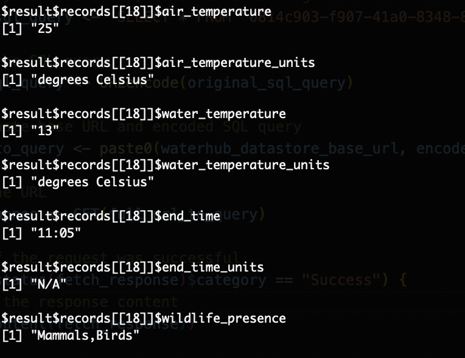

# Water Hub R SQL Example

In this example, we will use R to query the Water Hub datastore using SQL syntax. 

## Requires
- R must be installed
- Install the "httr" package from R By doing the following:
  - Open the R console with ```R``` in the terminal
  - Run: ```install.packages("httr")```
  - Follow the prompts to select a mirror and download the packages required for "httr"

## Run the example using R Console
- Navigate to the current working directory and open "R" in the terminal
- Run the source as: ```source("waterhub-r-example.r")```

## Or to run with RStudio
- Open the script in R Studio
- Click the "Source" button to run it!

## Screenshot snippet of the outcome



## Made by the Water Hub Team